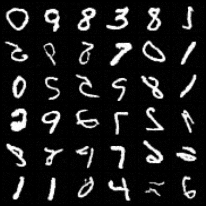

# Diffusion

My attempt to replicate the [Denoising Diffusion Probabilistic Model](https://arxiv.org/abs/2006.11239) and make some fake digits and celebrities.

Shout-out to [LucidRains](https://github.com/lucidrains/denoising-diffusion-pytorch) for the inspiration and the code.

